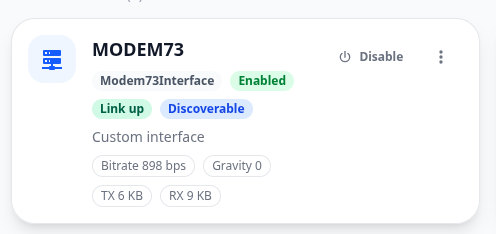
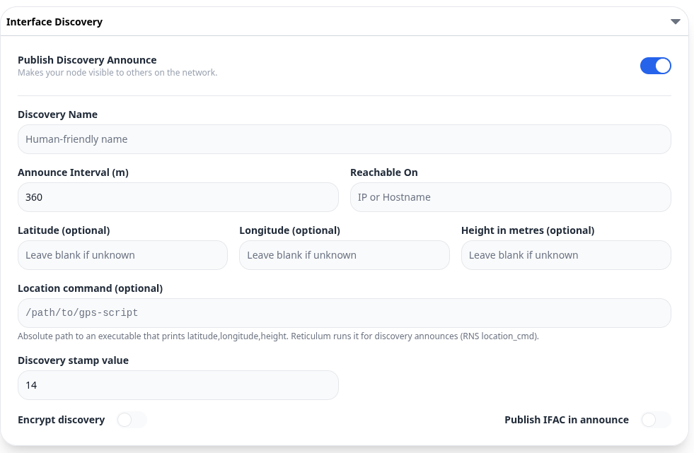
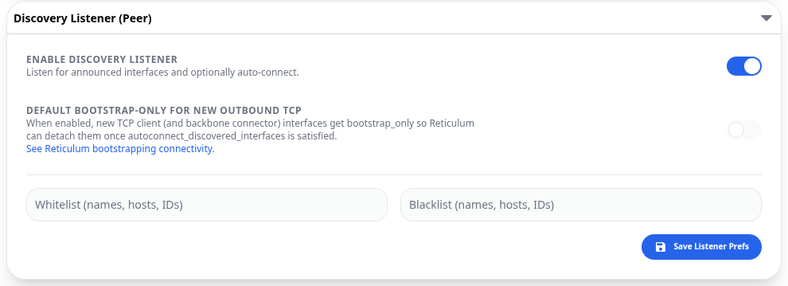
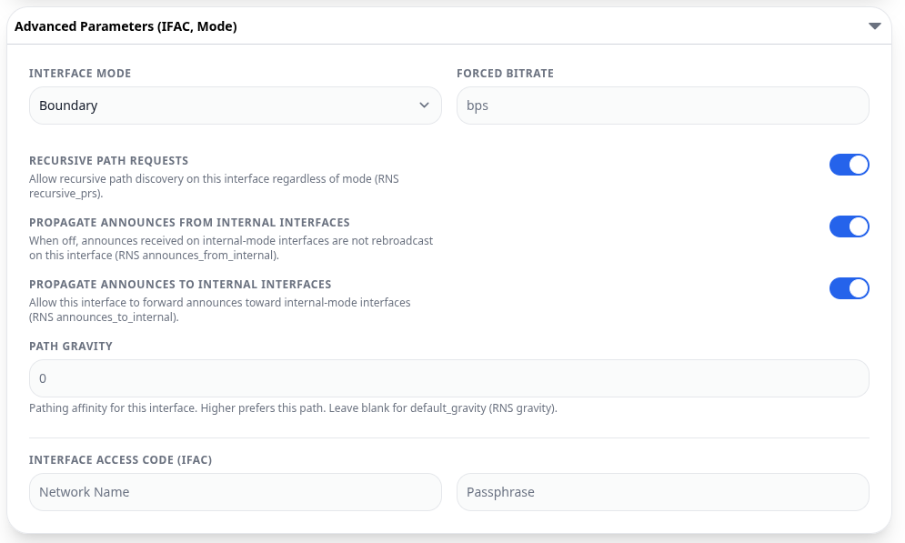

# Reticulum over VHF

Reticulum mesh networking over VHF radio using Baofeng UV-5R and Modem73.

## Part List

- 1x PC (Linux)
- 1x Android device
- 2x [Baofeng UV-5R](https://www.baofengradio.com/)
- 2x All In One Audio Cable (AIOC)
- [Reticulum MeshChatX](https://github.com/Quad4-Software/MeshChatX) v4.8.6 — on Android and PC Linux (AppImage)
- [Modem73](https://github.com/RFnexus/modem73) — PC v2.4.0, Android v1.0.2
- [Modem73 Interface](https://github.com/RFnexus/modem73interface)
- *(Optional)* Generic USB RTL-SDR dongle — to monitor communication between the two radios

## Modem73 Configuration

From the [Modem73 repository](https://github.com/RFnexus/modem73):

> To use the All In One Audio cable, set PTT to **COM**, specify your COM port, and set PTT line to **BOTH** and Invert to **INVERT RTS**.

Config token: `M73-4N8R-22RK-VEX0-C8V8-0YRZ-Z`

Before running MeshChatX, I usually confirm radio link by sending M73 test messages first.

## MeshChatX Configuration

Import the Modem73 interface on both installations:

1. Open the left sidebar → **Interfaces** → **Add interface** → **Basic configuration**
2. Scroll down, select the **More option...** drop-down menu
3. Choose **Custom / external module** (RNS interface path)
4. Select and install the module (`.py`)

Configure as shown in the screenshots below.

> **Warning:** This is my first time configuring Reticulum — some settings may not be the most secure, but they are currently working.

# Video
A quick and dirty video of me testing the communication [video](https://www.youtube.com/watch?v=wSNq0uCv1-w)

## License

This project is licensed under the [MIT License](LICENSE).
