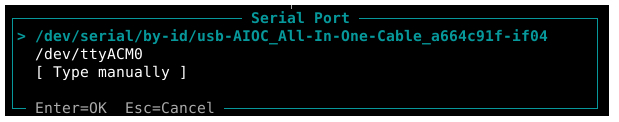
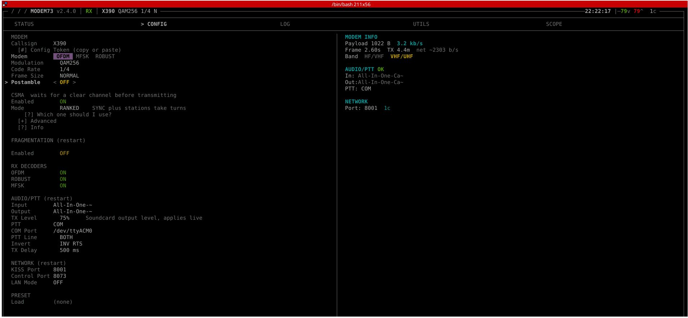
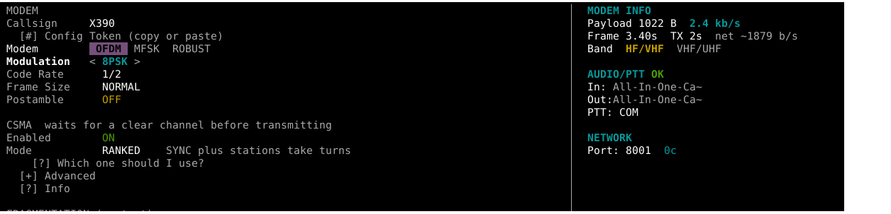
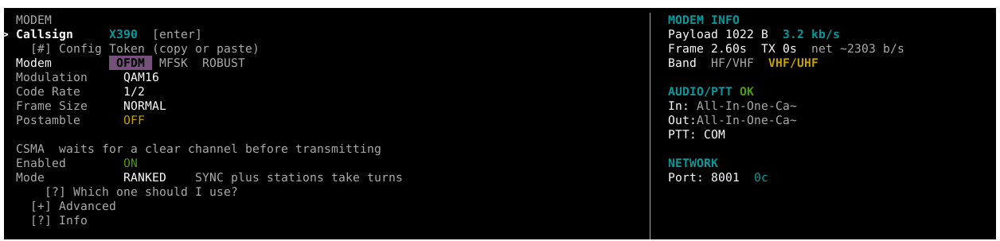

# Reticulum over VHF

Reticulum mesh networking over VHF radio using Baofeng UV-5R and Modem73.

## Part List

- 1x PC (Linux)
- 1x Android device
- 2x <a href="https://www.baofengradio.com/" target="_blank">Baofeng UV-5R</a>
- 2x All In One Audio Cable (AIOC)
- <a href="https://github.com/Quad4-Software/MeshChatX" target="_blank">Reticulum MeshChatX</a> v4.8.6 — on Android and PC Linux (AppImage)
- <a href="https://github.com/RFnexus/modem73" target="_blank">Modem73</a> — PC v2.4.0, Android v1.0.2
- <a href="https://github.com/RFnexus/modem73interface" target="_blank">Modem73 Interface</a>
- *(Optional)* Generic USB RTL-SDR dongle — to monitor communication between the two radios

## Modem73 Configuration

From the <a href="https://github.com/RFnexus/modem73" target="_blank">Modem73 repository</a>:

> To use the All In One Audio cable, set PTT to **COM**, specify your COM port, and set PTT line to **BOTH** and Invert to **INVERT RTS**.

On my Debian 13, I can set the AIOC with a device ID that won't change on re-insertion.

## Initial Tutorial

My first test used QAM256 at 1/4 code rate, which is **not recommended** for cheap handhelds like the UV-5R — radios in close proximity will suffer from overload and desensitization. Based on feedback from the <a href="https://github.com/glompos21/reticulumOverVHF/issues/1" target="_blank">Modem73 developer</a>:

- Use a **lower modulation order** (8PSK or QAM16) instead of QAM256
- Use **1/2 code rate** — 1/4 is intended for HF with significant fading, not VHF/UHF
- QAM16 at 1/2 achieves ~3.2 kb/s
- Real-world example: 8PSK 2/3 coding at MID TX power works over ~1 km with UV-K5s

See also the <a href="https://github.com/RFnexus/modem73interface/blob/master/lxmf.patch" target="_blank">LXMF patch</a> for messaging fixes.

### Modem73 Config Tokens

| Modulation | Code Rate | Config Token |
|------------|-----------|--------------|
| QAM256 | 1/4 | `M73-4N8R-22RK-VEX0-C8V8-0YRZ-Z` |
| 8PSK | 1/2 | `M73-4NDZ-210K-VEK0-C8V8-0YRZ-Z` |
| QAM16 | 1/2 | `M73-4NCW-21GK-VEK0-C8V8-0YRZ-Z` |
#### Modem73 config QAM256

#### Modem73 config 8PSK

#### Modem73 config 8PSQAM16K

Before running MeshChatX, I usually confirm radio link by sending M73 test messages first.

## MeshChatX Configuration

Import the Modem73 interface on both installations:

1. Open the left sidebar → **Interfaces** → **Add interface** → **Basic configuration**
2. Scroll down, select the **More option...** drop-down menu
3. Choose **Custom / external module** (RNS interface path)
4. Select and install the module (`.py`)

Configure as shown in the screenshots below.

> **Warning:** This is my first time configuring Reticulum — some settings may not be the most secure, but they are currently working.

## Video
Both radios were located on top of the desk with a distance of 0.5m.

Quick demo videos of the setup in action:

- <a href="https://www.youtube.com/watch?v=wSNq0uCv1-w" target="_blank">Configuration and testing — QAM256 (not recommended)</a>
- <a href="https://www.youtube.com/watch?v=8gYLd53u7lA" target="_blank">Testing modulation 8PSK, QAM16</a>

## License

This project is licensed under the [MIT License](LICENSE).
